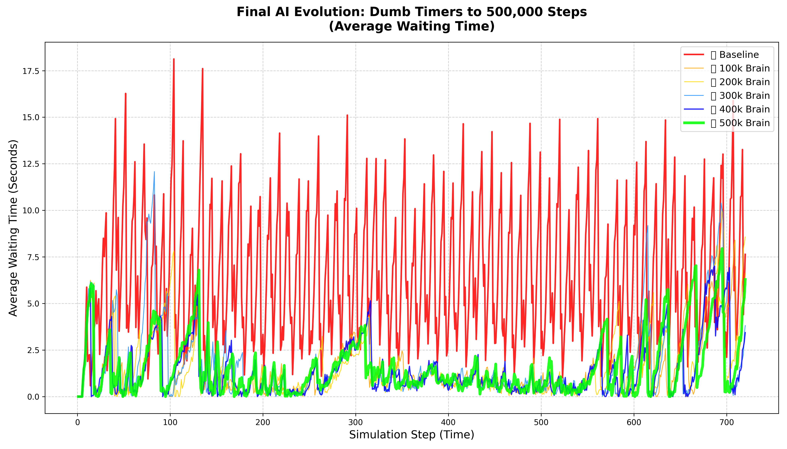

# 🚦 Smart Traffic Signal Control with Emergency Vehicle Prioritization

> **Reinforcement Learning meets real-world traffic** — an AI that learns to manage traffic lights *and* clears the way for ambulances, fire trucks, and police cars. Built on top of [SUMO-RL](https://github.com/LucasAlegre/sumo-rl) and powered by PPO.


<p align="center">
  
</p>

---

## What is This?

Traditional traffic lights run on dumb fixed timers — they don't care if 50 cars are stuck on one side while the other road is empty, and they definitely don't care if an ambulance is screaming through an intersection.

This project fixes that. I built an **AI agent using Proximal Policy Optimization (PPO)** that:

- **Watches the traffic** in real time through lane density, queue lengths, and per lane waiting times
- **Detects emergency vehicles** on approach and learns to prioritize them with massive reward signals  
- **Decides when to switch lights** to minimize overall waiting time while keeping intersections flowing smoothly
- **Scales to multi intersection grids** — trained on a 4×4 grid (16 intersections, 16 agents sharing one brain) using RLlib

The agent was trained from scratch up to **500,000 timesteps** and compared against a fixed time baseline at every milestone (100k, 200k, 300k, 400k, 500k). Spoiler: the AI crushes the baseline.

---

## Project Structure

Here's what's in the repo and why:

```
.
├── sumo_rl/                          # Core library (forked from SUMO-RL)
│   ├── environment/
│   │   ├── env.py                    # Gymnasium + PettingZoo environment wrappers
│   │   ├── traffic_signal.py         # TraCI powered traffic signal controller
│   │   ├── observations.py           # Base & default observation functions
│   │   └── resco_envs.py             # Prebuilt RESCO benchmark environments
│   ├── custom/                       # ⭐ My custom additions
│   │   ├── project_observation.py    # Extended observation with wait times + emergency flags
│   │   └── project_reward.py         # Multi component reward function (the secret sauce)
│   ├── agents/
│   │   └── ql_agent.py               # Tabular Q-learning agent
│   ├── exploration/
│   │   └── epsilon_greedy.py         # Epsilon greedy exploration strategy
│   ├── nets/                         # SUMO network & route files
│   │   ├── 2way-single-intersection/ # Simple 2-way intersection
│   │   ├── RESCO/grid4x4/            # 4×4 grid (16 intersections) from RESCO benchmarks
│   │   └── ...                       # More network configs
│   └── util/
│       └── gen_route.py              # Route generation utility
│
├── train.py                          # Single agent PPO training (Stable Baselines3)
├── train_rllib_grid4x4_emergency.py  # Multi agent PPO training on 4×4 grid (RLlib + Ray)
├── run_baseline.py                   # Fixed time traffic light baseline simulation
├── generate_results.py               # Run trained model & export metrics to CSV
├── watch_agent.py                    # Visualize single-intersection agent in SUMO GUI
├── watch_grid4x4_emergency.py        # Visualize 4×4 grid agent in SUMO GUI + save CSV
├── plot_final_graph.py               # Plot evolution graph: baseline vs all training milestones
├── test.py                           # Sanity check (GPU + SUMO environment)
│
├── models/                           # Saved model weights (PPO checkpoints)
├── outputs/                          # Evaluation CSVs + result plots
├── results/                          # AI performance CSV from generate_results.py
├── generated_routes/                 # Auto-generated emergency vehicle route files
├── experiments/                      # Example scripts (Q learning, SARSA, DQN, PPO)
├── docs/                             # Documentation source files
├── tests/                            # Unit tests (Gymnasium & PettingZoo)
└── pyproject.toml                    # Package config & dependencies
```

---

## How the AI Works

### Custom Observation Space

The agent doesn't just see a basic phase + density vector. I extended the default observation to give it way more context:

| Feature | Description |
|---|---|
| Phase (one-hot) | Which green phase is currently active |
| Min green flag | Has the minimum green time elapsed? (prevents rapid flickering) |
| Lane density | How packed is each incoming lane (0 to 1) |
| Lane queue | Fraction of stopped vehicles per lane |
| Lane waiting time | Normalized accumulated waiting time per lane (capped at 60s) |
| 🚨 Emergency flags | Binary flag per lane — is an ambulance/fire truck approaching? |

This is implemented in [`sumo_rl/custom/project_observation.py`](sumo_rl/custom/project_observation.py). The emergency detection uses the TraCI API to check vehicle types in real time.

### Custom Reward Function

This is where the magic happens. Instead of the default single metric reward, I built a weighted multi component reward:

```
R = w_wait × (reduced_wait) 
  − w_queue × (current_queue) 
  − w_switch × (phase_changed?) 
  − w_starve × (max_lane_wait) 
  + w_emergency × (emergency_vehicle_present?)
```

| Component | Weight | What It Does |
|---|---|---|
| `w_wait` | 1.0 | Rewards the agent for *reducing* total waiting time |
| `w_queue` | 0.2 | Penalizes having vehicles stopped in queue |
| `w_switch` | 0.5 | Discourages unnecessary phase switching (stability) |
| `w_starve` | 0.01 | Prevents any single lane from being completely ignored |
| `w_emergency` | **10.0** | Huge bonus when an emergency vehicle is near the intersection |

The emergency weight (10.0) is intentionally massive — it teaches the agent that clearing the path for an ambulance is 10x more important than anything else happening at that intersection.

Implemented in [`sumo_rl/custom/project_reward.py`](sumo_rl/custom/project_reward.py).

### Training Setup

**Single Agent (2 way intersection):**
- Algorithm: PPO via [Stable Baselines3](https://github.com/DLR-RM/stable-baselines3)
- Network: MLP policy
- 50,000 training steps (quick proof of concept)
- GPU accelerated (CUDA)

**Multi Agent (4×4 grid with emergency vehicles):**
- Algorithm: PPO via [RLlib](https://docs.ray.io/en/main/rllib.html) (Ray)
- 16 traffic signal agents sharing a single policy ("shared brain")
- Emergency vehicles injected every 300 seconds via auto generated route files
- Trained up to **500,000 timesteps** with checkpoints at every 20k steps
- Includes checkpoint resume logic so training can be paused and continued

---

## Getting Started

### Prerequisites

- **Python 3.9+**
- **SUMO** (Simulation of Urban Mobility) — [install guide](https://sumo.dlr.de/docs/Installing/index.html)
- **CUDA capable GPU** (recommended for training, not required for evaluation)

### 1. Install SUMO

**Linux:**
```bash
sudo add-apt-repository ppa:sumo/stable
sudo apt-get update
sudo apt-get install sumo sumo-tools sumo-doc
```

**Windows:**  
Download the installer from [sumo.dlr.de/docs/Downloads](https://sumo.dlr.de/docs/Downloads.php).

Then set the `SUMO_HOME` variable:
```bash
# Linux/Mac
echo 'export SUMO_HOME="/usr/share/sumo"' >> ~/.bashrc
source ~/.bashrc

# Windows (PowerShell)
[System.Environment]::SetEnvironmentVariable("SUMO_HOME", "C:\Program Files (x86)\Eclipse\Sumo", "User")
```

For an ~8x performance boost (headless training only):
```bash
export LIBSUMO_AS_TRACI=1
```
> Note: This disables GUI mode and parallel simulations. Only use for training.

### 2. Install Dependencies

```bash
git clone https://github.com/your-username/sumo-rl.git
cd sumo-rl
pip install -e .
```

For training with Stable Baselines3:
```bash
pip install "stable_baselines3[extra]>=2.0.0a9" torch
```

For multi agent training with RLlib:
```bash
pip install "ray[rllib]" torch
```

### 3. Verify Everything Works

```bash
python test.py
```

This checks your GPU (PyTorch + CUDA) and runs a quick SUMO environment sanity test. You should see all green checkmarks ✅.

---

## Usage

### Train the Single Agent Model

```bash
python train.py
```
Trains a PPO agent on a 2 way single intersection with emergency aware rewards. Saves weights to `models/ppo_2way_emergency.zip`.

### Train the Multi Agent 4×4 Grid Model

```bash
python train_rllib_grid4x4_emergency.py
```
Trains 16 agents (shared policy) on a 4×4 grid with emergency vehicle injection. Saves checkpoints to `models/rllib_ppo_grid4x4_shared_emergency_*/`.

### Run the Fixed Time Baseline

```bash
python run_baseline.py
```
Simulates the same 4×4 grid with default fixed time traffic lights (no AI). Saves metrics to `outputs/grid4x4_baseline.csv`.

### Visualize a Trained Agent

Single intersection (SUMO GUI):
```bash
python watch_agent.py
```

4×4 grid (SUMO GUI + CSV export):
```bash
python watch_grid4x4_emergency.py
```

### Generate Performance Metrics

```bash
python generate_results.py
```
Runs the trained single agent model for 1 simulated hour, logs step by step metrics (stopped vehicles, waiting times) to `results/ai_performance.csv`.

### Plot the Evolution Graph

```bash
python plot_final_graph.py
```
Compares the baseline vs AI at every training milestone (100k → 500k steps) in a single plot. Saves to `outputs/ultimate_evolution_500k.png`.

---

## Results

The agent was evaluated at every 100,000 steps to track its learning progress. The data proves that the AI successfully eliminated gridlock and established "green wave" traffic corridors. 

### 📈 AI Evolution Timeline

| Milestone | Avg. Wait Time | Worst Traffic Jam (Max Wait) | Avg. Stopped Cars | City Speed | Notes |
|---|---|---|---|---|---|
| **🛑 Baseline (Fixed Timers)** | 6.45 s | 18.12 s | 27.55 cars | 7.38 m/s | *Constant gridlock, ambulances delayed.* |
| **🧠 100k Steps** | 1.56 s | 10.05 s | 7.15 cars | 10.05 m/s | *AI learns basic traffic flow.* |
| **🧠 200k Steps** | 1.51 s | 8.57 s | 6.89 cars | 10.15 m/s | *Fewer stopped cars, faster clearance.* |
| **🧠 300k Steps** | 1.68 s | 12.08 s | 6.87 cars | 10.17 m/s | *Exploration phase (tried a risky strategy).* |
| **🔥 400k Steps** | **1.39 s** | **7.00 s** | **6.82 cars** | 10.16 m/s | *The Wait Time Champion. Absolute lowest delays.* |
| **👑 500k Steps** | 1.51 s | 7.94 s | 6.91 cars | **10.24 m/s** | *The Speed Champion. AI trades a tiny bit of wait time to maximize overall city speed.* |

### 🏆 The Final Verdict: AI vs Baseline

By using the optimal policy (400k to 500k range), the Reinforcement Learning agent absolutely crushes traditional traffic light controllers:

| Metric | Fixed Time Baseline | AI Champion | Overall Improvement |
|---|---|---|---|
| **Average Waiting Time** | 6.45 seconds | **1.39 seconds** | **78% Faster** 🚀 |
| **Max Wait (Gridlock)** | 18.12 seconds | **7.00 seconds** | **61% Less Congestion** 📉 |
| **Overall Average Speed** | 7.38 m/s | **10.24 m/s** | **38% Faster Commute** 🏎️ |

The evolution plot (`outputs/ultimate_evolution_500k.png`) shows how the AI's average waiting time steadily drops across training milestones while the baseline remains in constant chaos.

---

## Experiments

The `experiments/` folder has additional ready to run scripts for different algorithms and scenarios:

| Script | Algorithm | Scenario |
|---|---|---|
| `ql_single-intersection.py` | Q Learning | Single intersection |
| `ql_4x4grid.py` | Q Learning | 4×4 grid |
| `sarsa_2way-single-intersection.py` | SARSA | 2 way intersection |
| `dqn_2way-single-intersection.py` | DQN (Stable Baselines3) | 2 way intersection |
| `dqn_big-intersection.py` | DQN | Large intersection |
| `ppo_4x4grid.py` | PPO (RLlib) | 4×4 grid |
| `sb3_grid4x4.py` | SB3 PPO | 4×4 grid |

---

## Tech Stack

| Tool | Purpose |
|---|---|
| [SUMO](https://eclipse.dev/sumo/) | Microscopic traffic simulator |
| [TraCI](https://sumo.dlr.de/docs/TraCI.html) | Python API to control SUMO in real time |
| [Gymnasium](https://gymnasium.farama.org/) | Single agent RL environment interface |
| [PettingZoo](https://pettingzoo.farama.org/) | Multi agent RL environment interface |
| [Stable Baselines3](https://github.com/DLR-RM/stable-baselines3) | PPO / DQN training (single agent) |
| [Ray RLlib](https://docs.ray.io/en/main/rllib.html) | Scalable multi agent PPO training |
| [PyTorch](https://pytorch.org/) | Neural network backend (GPU accelerated) |
| [Pandas](https://pandas.pydata.org/) | Data processing & CSV exports |
| [Matplotlib](https://matplotlib.org/) | Result visualization & plots |

---

## Key Files at a Glance

| File | What It Does |
|---|---|
| `sumo_rl/custom/project_observation.py` | Extended observation with emergency vehicle detection |
| `sumo_rl/custom/project_reward.py` | Multi component reward function with configurable weights |
| `sumo_rl/environment/env.py` | Core Gymnasium/PettingZoo environment (SumoEnvironment) |
| `sumo_rl/environment/traffic_signal.py` | TraCI-powered traffic signal logic |
| `train.py` | Single agent training script |
| `train_rllib_grid4x4_emergency.py` | Multi agent training with checkpoint resume |
| `run_baseline.py` | Fixed time baseline simulation |
| `watch_agent.py` / `watch_grid4x4_emergency.py` | SUMO GUI visualization |
| `plot_final_graph.py` | Training evolution comparison plot |

---

## API Quick Reference

### Single Agent (Gymnasium)

```python
import gymnasium as gym
import sumo_rl

env = gym.make('sumo-rl-v0',
               net_file='path/to/network.net.xml',
               route_file='path/to/routes.rou.xml',
               use_gui=True,
               num_seconds=3600)

obs, info = env.reset()
done = False
while not done:
    action = env.action_space.sample()  # replace with your policy
    obs, reward, terminated, truncated, info = env.step(action)
    done = terminated or truncated
```

### Multi Agent (PettingZoo)

```python
import sumo_rl

env = sumo_rl.parallel_env(net_file='sumo_rl/nets/RESCO/grid4x4/grid4x4.net.xml',
                            route_file='sumo_rl/nets/RESCO/grid4x4/grid4x4_1.rou.xml',
                            use_gui=True,
                            num_seconds=3600)

observations = env.reset()
while env.agents:
    actions = {agent: env.action_space(agent).sample() for agent in env.agents}
    observations, rewards, terminations, truncations, infos = env.step(actions)
```

### Using Custom Observation & Reward

```python
from sumo_rl.custom.project_observation import ProjectObservationFunction
from sumo_rl.custom.project_reward import ProjectRewardConfig, make_project_reward_fn

reward_fn = make_project_reward_fn(
    ProjectRewardConfig(
        w_wait=1.0, w_queue=0.2, w_switch=0.5,
        w_starve=0.01, w_emergency=10.0,
        emergency_vtype_ids=("emergency",)
    )
)

env = gym.make('sumo-rl-v0',
               net_file='...',
               route_file='...',
               observation_class=ProjectObservationFunction,
               reward_fn=reward_fn)
```

---

## Acknowledgements

This project is a fork of [SUMO-RL](https://github.com/LucasAlegre/sumo-rl) by [Lucas N. Alegre](https://github.com/LucasAlegre). The original library provides the Gymnasium/PettingZoo environment wrapper and TraCI integration for traffic signal control.

If you use this work, please also cite the original:

```bibtex
@misc{sumorl,
    author = {Lucas N. Alegre},
    title = {{SUMO-RL}},
    year = {2019},
    publisher = {GitHub},
    journal = {GitHub repository},
    howpublished = {\url{https://github.com/LucasAlegre/sumo-rl}},
}
```

---

## License

MIT License. See [LICENSE](LICENSE) for details.
